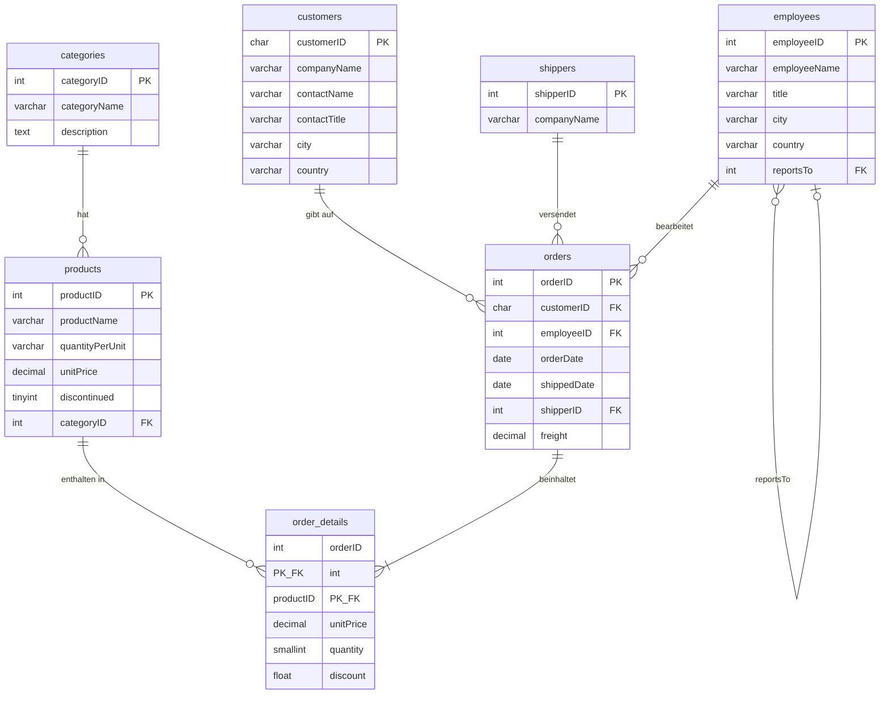

# Northwind – Datenbankschema (ERD)

## Legende

| Symbol | Bedeutung |
|--------|-----------|
| `PK`   | Primary Key |
| `FK`   | Foreign Key |
| `\|\|--o{` | Eins zu viele (optional) |
| `\|\|--\|{` | Eins zu viele (pflicht) |
| `}o--o\|` | Self-Join (employees → Vorgesetzter) |
